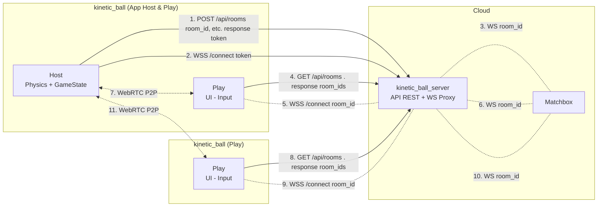

<p align="center">
  
</p>

# kinetic_ball

A multiplayer physics-based ball game inspired by HaxBall, written in Rust using [Bevy](https://bevyengine.org/) and [Matchbox](https://github.com/johanhelsing/matchbox) for WebRTC peer-to-peer networking.

> **New!** Recently restructured into a unified application - you can now host or join games from the same app, with an integrated room browser and creation UI.

[kinetic_ball.webm](https://github.com/user-attachments/assets/be8b2554-8de4-4d9b-b5e9-213c9693464f)


## Features

- **Unified app**: Host or join games from the same application
- Authoritative physics simulation with Rapier2D
- WebRTC peer-to-peer networking via matchbox_socket
- Room/lobby system with REST API
- Create and host rooms directly from the UI
- Custom map support (HaxBall format `.hbs`, `.json`, `.json5`) (Work In Progress)
- Configurable keybindings (saved in `~/.config/rustball/keybindings.ron`)
- Minimap and player detail camera
- Kick system with curve/spin effect
- Sprint, slide and cube mode

## Requirements

- Rust 1.75+
- `matchbox_server` for WebRTC signaling (for local development)

```bash
cargo install matchbox_server
```

## Building

```bash
# Build the unified game application
cargo build --release -p kinetic_ball

# Build the cloud server (optional, for dedicated hosting)
cargo build --release -p kinetic_ball_server

# Or build everything at once
cargo build --release
```

**Binaries will be located at:**
- `target/release/kinetic_ball` (or `kinetic_ball.exe` on Windows)
- `target/release/kinetic_ball_server` (or `kinetic_ball_server.exe` on Windows)

You can distribute the `kinetic_ball` binary to players - it's a standalone executable that includes all game assets.

## How to Play

### Quick Start (Local Game)

1. **Start the infrastructure (one time setup):**
   ```bash
   # Terminal 1: Start matchbox signaling server
   matchbox_server

   # Terminal 2: Start the proxy/lobby server
   cargo run --release -p kinetic_ball_server -- --port 3537 --matchbox-url ws://127.0.0.1:3536
   ```

2. **Launch the game:**
   ```bash
   cargo run --release -p kinetic_ball
   ```

3. **Play:**
   - **To host a game:** Click "Crear Sala" → Configure room settings → Click "Crear y Hostear"
   - **To join a game:** Click "Ver Salas" → Double-click a room to join
   - **Configure keys:** Click "Teclas" to customize keybindings

**That's it!** The same application can host or join games. When hosting, the physics server runs in the background while you play with the graphical interface.

### Room Creation Options

When creating a room, you can configure:
- **Room name**: Display name for the lobby
- **Max players**: 2-16 players
- **Map** (optional): Path to a custom map file (`.hbs`, `.json`, `.json5`)
- **Map scale**: Scale multiplier for the map (0.5-2.0)

### Architecture



- **kinetic_ball_server**: Unified cloud server (REST API + WebSocket proxy + Matchbox signaling)
- **kinetic_ball (Host Mode)**: Runs physics simulation + renders locally
- **kinetic_ball (Client Mode)**: Connects to a room and renders game state

**Key advantage**: The same binary can host or join games. No need for separate client/server processes.

### Online Play with ngrok

To play with friends over the internet, expose the server using [ngrok](https://ngrok.com/):

1. **Start the infrastructure locally:**
   ```bash
   # Terminal 1: matchbox_server (local signaling)
   matchbox_server

   # Terminal 2: kinetic_ball_server
   cargo run --release -p kinetic_ball_server -- --port 3537 --matchbox-url ws://127.0.0.1:3536
   ```

2. **Expose server with ngrok:**
   ```bash
   ngrok http 3537
   ```
   ngrok will give you a URL like `https://xxxx.ngrok-free.app`

3. **Everyone connects using the ngrok URL:**
   - Launch `kinetic_ball`
   - In the menu, change "Servidor" to `xxxx.ngrok-free.app` (without protocol)
   - Click "Crear Sala" to host, or "Ver Salas" to join

**Note:** The host will run the physics locally and see the game with zero latency. Remote players connect via WebRTC P2P after signaling through the proxy.

## Controls


### Sphere Mode
Default mode that allows ball control and kicking

| Action | Default Key |
|--------|-------------|
| Move | Arrow keys |
| Kick | S |
| Curve left | A |
| Curve right | D |
| Sprint/Run | Space |
| Don't touch ball | Shift |

### Cube Mode (Right Ctrl)
Allows sliding and dribbling, always runs and doesn't interact with the ball without performing an action.
When stamina runs out, it automatically returns to sphere mode.

| Action | Default Key |
|--------|-------------|
| Slide | S |
| Slide right | D |
| Slide left | A |
| Direction change | Space + arrows |

### Settings
| Action | Key |
|--------|-----|
| Camera zoom | Keys 1-9 |

Keybindings can be reconfigured from the "Keys" menu in the client.

## Project Structure

```
kinetic_ball/
├── kinetic_ball/              # Unified game application
│   └── src/
│       ├── main.rs            # Client UI and rendering
│       ├── keybindings.rs     # Configurable controls
│       ├── shared/            # Shared code (protocol, maps, movements)
│       │   ├── mod.rs
│       │   ├── protocol.rs    # Network messages
│       │   ├── map.rs         # Map structures
│       │   └── movements.rs   # Animations
│       └── host/              # Host mode (physics server)
│           ├── mod.rs
│           ├── host.rs        # Host entry point
│           ├── engine.rs      # Physics and game logic
│           ├── network.rs     # WebRTC server + proxy registration
│           ├── map/           # Map loading and conversion
│           └── input/         # Input handling
├── kinetic_ball_server/       # Cloud server (proxy + signaling)
│   └── src/
│       ├── main.rs            # CLI + axum server
│       ├── state.rs           # Room state management
│       ├── api/               # REST API (rooms CRUD)
│       └── ws/                # WebSocket proxy to matchbox
├── maps/                      # Custom maps
├── images/                    # Assets
└── docs/                      # Documentation and ADRs
```

**Key points:**
- `kinetic_ball` is a single binary that can host or join games
- Host mode includes physics simulation (`host/` module)
- Client mode only uses rendering and UI (`main.rs`)
- `kinetic_ball_server` is optional for dedicated hosting

## Maps

The game supports custom maps in HaxBall format (`.hbs`) and JSON/JSON5. When creating a room, you can specify:
- **Map path**: e.g., `maps/futsal_fah.hbs`
- **Scale**: Adjust map size from 0.5x to 2.0x

Leave the map field empty to use the default arena.

To create compatible maps, you can use the [HaxBall Map Editor](https://www.haxball.com/mapeditor) or create them manually in JSON5 format.

## Troubleshooting

### "No rooms available" / Can't see created rooms
- Make sure `kinetic_ball_server` is running on the correct port
- Check that the server URL in the menu matches your proxy (default: `127.0.0.1:3537`, without protocol)
- Verify `matchbox_server` is running (needed for WebRTC signaling)

### Connection issues
- **Local play**: Both proxy and matchbox should be on localhost
- **Online play**: Use the same ngrok URL for all players
- **Firewall**: Ensure WebRTC ports are not blocked (or use ngrok)

### High latency
- When hosting locally, the host always has zero latency (direct access to physics)
- Remote players connect P2P via WebRTC - latency depends on internet connection
- For best results, the host should have good upload speed

## Architecture Evolution

The project recently underwent a major restructuring (see [ADR-001](docs/adr/001-restructure-client-server-architecture.md)) to improve user experience:

**Before**: Separate client, server, and proxy binaries
**Now**: Unified `kinetic_ball` app that can host or join games

**Benefits:**
- Simpler UX: One app for everything
- Host with UI: No more headless server
- Easier distribution: Single binary for end users
- Localhost optimization: WebRTC uses loopback for local host+client

## Future Development

This project is under active development. Some ideas for contribution:

- Goal system and scoreboard
- Team selection (red/blue) in room creation
- In-game chat
- Replay/match recording
- WebAssembly compilation for browser play
- Power-ups and alternative game modes
- Netcode improvements (client-side prediction, reconciliation)
- Integrated map editor in the UI
- Automatic updates and distribution
- Docker deployment for `kinetic_ball_server`
- Auto TLS with Let's Encrypt (rustls-acme support included)

## Contributing

Contributions are welcome. Fork the repo, create a branch, and open a PR.

## License

MIT
