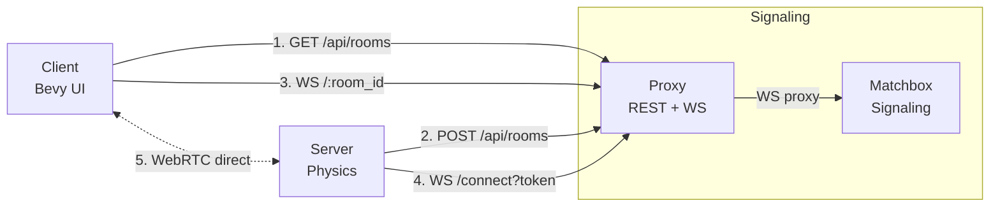

<p align="center">
  
</p>

# kinetic_ball

Inspired by seeing how much could be done with just an X in HaxBall, written in Rust using [Bevy](https://bevyengine.org/) as the game engine and [Matchbox](https://github.com/johanhelsing/matchbox) for WebRTC peer-to-peer networking.

[kinetic_ball.webm](https://github.com/user-attachments/assets/be8b2554-8de4-4d9b-b5e9-213c9693464f)


## Features

- Authoritative server with Rapier2D physics
- Graphical client with Bevy 0.17
- WebRTC peer-to-peer networking via matchbox_socket
- Room/lobby system with proxy server for room management
- Custom map support (HaxBall format `.hbs`, `.json`, `.json5`) (Work In Progress)
- Configurable keybindings (saved in `~/.config/rustball/keybindings.ron`)
- Minimap and player detail camera
- Kick system with curve/spin effect
- Sprint, slide and cube mode

## Requirements

- Rust 1.75+
- `matchbox_server` for WebRTC signaling

```bash
cargo install matchbox_server
```

## Building

```bash
# Build everything (server + client + proxy + shared)
cargo build --release

# Or build separately
cargo build --release -p server
cargo build --release -p client
cargo build --release -p proxy
```

## How to Play

### Local Game (same machine)

1. **Start the matchbox signaling server:**
   ```bash
   matchbox_server
   ```
   This starts the signaling server at `ws://127.0.0.1:3536`

2. **Start the proxy server:**
   ```bash
   cargo run --release -p proxy -- --port 3537 --matchbox-url ws://127.0.0.1:3536
   ```
   The proxy manages room registration and provides a lobby system.

3. **Start the game server:**
   ```bash
   cargo run --release -p server -- --room my_room --room-name "My Game Room"
   ```
   Useful options:
   ```bash
   # With a custom map
   cargo run --release -p server -- --room my_room --map maps/futsal_fah.hbs

   # List available maps
   cargo run --release -p server -- --list-maps

   # Scale the map
   cargo run --release -p server -- --room my_room --map maps/cancha_grande.json5 --scale 1.5

   # Set max players
   cargo run --release -p server -- --room my_room --max-players 6
   ```

4. **Start the client:**
   ```bash
   cargo run --release -p client
   ```
   The client will show a menu where you can:
   - Click "Ver Salas" to see available rooms
   - Double-click a room to join
   - Configure keybindings in "Teclas"

### Architecture



- **Matchbox Server**: WebRTC signaling for peer-to-peer connections
- **Proxy**: Room management, REST API for listing rooms, WebSocket proxy
- **Server**: Authoritative physics simulation, registers rooms with proxy
- **Client**: Graphical interface, fetches room list from proxy

### Online Play with ngrok

To play with friends over the internet, expose the proxy using [ngrok](https://ngrok.com/):

1. **Start matchbox_server:**
   ```bash
   matchbox_server
   ```

2. **Start the proxy:**
   ```bash
   cargo run --release -p proxy -- --port 3537 --matchbox-url ws://127.0.0.1:3536
   ```

3. **Expose proxy with ngrok:**
   ```bash
   ngrok http 3537
   ```
   ngrok will give you a URL like `https://xxxx.ngrok-free.app`

4. **Start the game server pointing to ngrok:**
   ```bash
   cargo run --release -p server -- \
     --proxy-url https://xxxx.ngrok-free.app \
     --room my_room \
     --room-name "My Online Game"
   ```

5. **Clients connect using the ngrok URL:**
   ```bash
   cargo run --release -p client -- --server wss://xxxx.ngrok-free.app
   ```
   Or simply change the "Servidor" field in the menu to `wss://xxxx.ngrok-free.app`

**Note:** The host running the server can also connect as a client.

## Controls


### Sphere Mode
Default mode that allows ball control and kicking

| Action | Default Key |
|--------|-------------|
| Move | Arrow keys |
| Kick | S |
| Curve left | A |
| Curve right | D |
| Sprint/Run | Space |
| Don't touch ball | Shift |

### Cube Mode (Right Ctrl)
Allows sliding and dribbling, always runs and doesn't interact with the ball without performing an action.
When stamina runs out, it automatically returns to sphere mode.

| Action | Default Key |
|--------|-------------|
| Slide | S |
| Slide right | D |
| Slide left | A |
| Direction change | Space + arrows |

### Settings
| Action | Key |
|--------|-----|
| Camera zoom | Keys 1-9 |

Keybindings can be reconfigured from the "Keys" menu in the client.

## Project Structure

```
kinetic_ball/
├── client/          # Bevy graphical client
│   └── src/
│       ├── main.rs
│       └── keybindings.rs
├── server/          # Authoritative physics server
│   └── src/
│       ├── main.rs
│       ├── engine.rs    # Physics and game logic
│       ├── network.rs   # WebRTC/Matchbox + proxy registration
│       ├── map/         # Map loading
│       └── input/       # Input handling
├── proxy/           # Room management proxy
│   └── src/
│       ├── main.rs      # CLI + axum server
│       ├── state.rs     # Room state management
│       ├── api/         # REST API (rooms CRUD)
│       └── ws/          # WebSocket proxy to matchbox
├── shared/          # Shared code
│   └── src/
│       ├── lib.rs
│       ├── protocol.rs  # Network messages
│       ├── map.rs       # Map structures
│       └── movements.rs # Animations
├── maps/            # Custom maps
└── images/          # Assets
```

## Maps

The server supports maps in HaxBall format (`.hbs`) and JSON/JSON5. Maps are loaded with `--map`:

```bash
cargo run -p server -- --map maps/futsal_fah.hbs
```

To create compatible maps, you can use the HaxBall editor or create them manually in JSON5.

## Future Development

This project is under active development. Some ideas for contribution:

- Goal system and scoreboard
- Team selection (red/blue)
- In-game chat
- Replay/match recording
- WebAssembly compilation for browser play
- Power-ups and alternative game modes
- Netcode improvements (client-side prediction, reconciliation)
- Support for more map formats
- Integrated map editor
- Auto TLS with Let's Encrypt for proxy (rustls-acme support included)

## Contributing

Contributions are welcome. Fork the repo, create a branch, and open a PR.

## License

MIT
