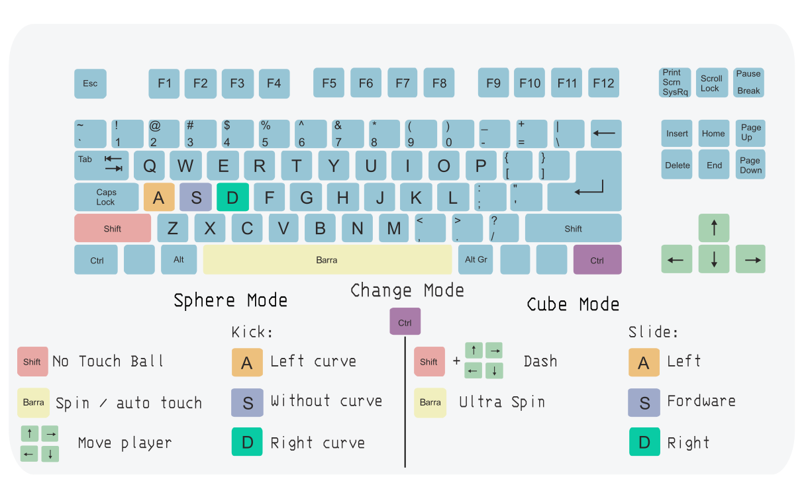

# RustBall

Inspirado en ver como usuando solo una X en HaxBall podían hacer tanto, escrito en Rust usando [Bevy](https://bevyengine.org/) para el motor de juego y [Matchbox](https://github.com/johanhelsing/matchbox) para networking WebRTC peer-to-peer.

## Características

- Servidor autoritativo con física en Rapier2D
- Cliente gráfico con Bevy 0.17
- Networking WebRTC peer-to-peer via matchbox_socket
- Soporte para mapas personalizados (formato HaxBall `.hbs`, `.json`, `.json5`)
- Teclas configurables (se guardan en `~/.config/rustball/keybindings.ron`)
- Minimapa y cámara de detalle del jugador
- Sistema de patadas con efecto/curva
- Sprint, barrida (slide) y modo cubo

## Requisitos

- Rust 1.75+
- `matchbox_server` para señalización WebRTC

```bash
cargo install matchbox_server
```

## Compilación

```bash
# Compilar todo (server + client + shared)
cargo build --release

# O compilar por separado
cargo build --release -p server
cargo build --release -p client
```

## Cómo jugar

### Juego Local (misma máquina)

1. **Iniciar el servidor de señalización matchbox:**
   ```bash
   matchbox_server
   ```
   Esto levanta el servidor de señalización en `ws://127.0.0.1:3536`

2. **Iniciar el servidor de juego:**
   ```bash
   cargo run --release -p server
   ```
   Opciones útiles:
   ```bash
   # Con un mapa personalizado
   cargo run --release -p server -- --map maps/futsal_fah.hbs

   # Listar mapas disponibles
   cargo run --release -p server -- --list-maps

   # Escalar el mapa
   cargo run --release -p server -- --map maps/cancha_grande.json5 --scale 1.5
   ```

3. **Iniciar el cliente:**
   ```bash
   cargo run --release -p client -- --name TuNombre
   ```

### Juego Online con ngrok

Para jugar con amigos por internet, necesitas exponer el servidor de señalización usando [ngrok](https://ngrok.com/):

1. **Iniciar matchbox_server:**
   ```bash
   matchbox_server
   ```

2. **Exponer con ngrok (en otra terminal):**
   ```bash
   ngrok http 3536
   ```
   ngrok te dará una URL como `https://xxxxxxxxxxxx.ngrok-free.app`

3. **Iniciar el servidor de juego apuntando a ngrok:**
   ```bash
   cargo run --release -p server -- \
     --signaling-url wss://xxxxxxxxxxxx.ngrok-free.app \
     --room mi_sala
   ```

4. **Los clientes se conectan usando la misma URL:**
   ```bash
   cargo run --release -p client -- \
     --server wss://xxxxxxxxxxxx.ngrok-free.app \
     --room mi_sala \
     --name Jugador1
   ```

**Nota:** El host que corre el servidor también puede conectarse como cliente.

## Controles



| Acción | Tecla por defecto |
|--------|-------------------|
| Mover | Flechas direccionales |
| Patear | S |
| Curva izquierda | A |
| Curva derecha | D |
| Sprint/Correr | Espacio |
| Barrer (slide) | Ctrl |
| No tocar pelota | Shift |
| Cambio de dirección | Espacio x2 + flechas |
| Modo cubo | Ctrl derecho |
| Zoom cámara | Teclas 1-9 |

Las teclas se pueden reconfigurar desde el menú "Teclas" en el cliente.

## Estructura del Proyecto

```
RustBall/
├── client/          # Cliente gráfico Bevy
│   └── src/
│       ├── main.rs
│       └── keybindings.rs
├── server/          # Servidor autoritativo
│   └── src/
│       ├── main.rs
│       ├── engine.rs    # Física y lógica de juego
│       ├── network.rs   # WebRTC/Matchbox
│       ├── map/         # Carga de mapas
│       └── input/       # Manejo de inputs
├── shared/          # Código compartido
│   └── src/
│       ├── lib.rs
│       ├── protocol.rs  # Mensajes de red
│       ├── map.rs       # Estructuras de mapas
│       └── movements.rs # Animaciones
├── maps/            # Mapas personalizados
└── images/          # Assets
```

## Mapas

El servidor soporta mapas en formato HaxBall (`.hbs`) y JSON/JSON5. Los mapas se cargan con `--map`:

```bash
cargo run -p server -- --map maps/futsal_fah.hbs
```

Para crear mapas compatibles, puedes usar el editor de HaxBall o crearlos manualmente en JSON5.

## Desarrollo Futuro

Este proyecto está en desarrollo activo. Algunas ideas para contribuir:

- Sistema de goles y marcador
- Selección de equipos (rojo/azul)
- Chat en el juego
- Replay/grabación de partidas
- Compilación a WebAssembly para jugar en el navegador
- Sistema de salas/lobbies
- Power-ups y modos de juego alternativos
- Mejoras de netcode (predicción del lado del cliente, reconciliación)
- Soporte para más formatos de mapas
- Editor de mapas integrado

## Contribuir

Las contribuciones son bienvenidas. Fork el repo, crea una rama, y abre un PR.

## Licencia

MIT
