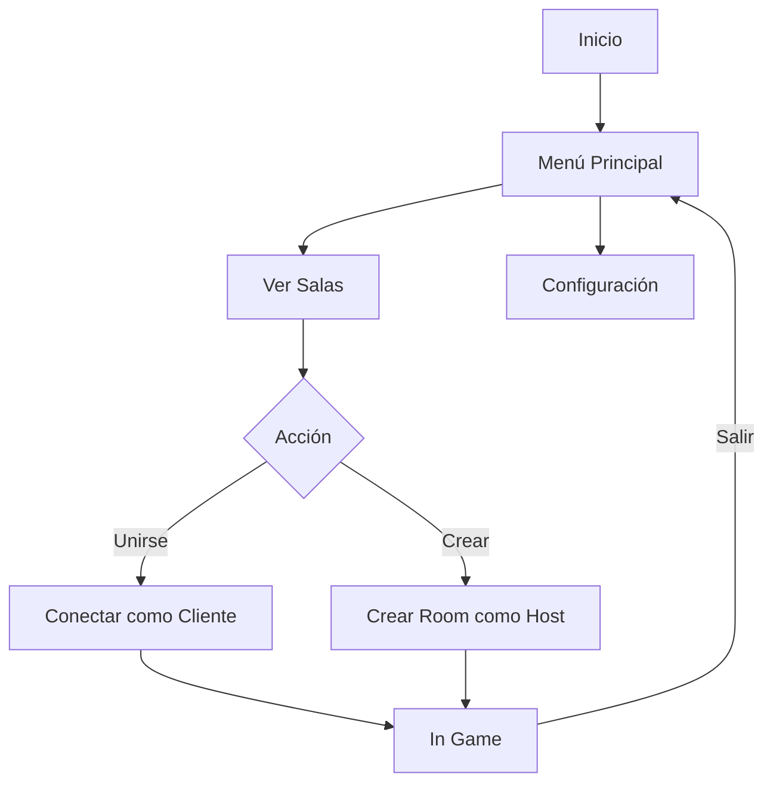
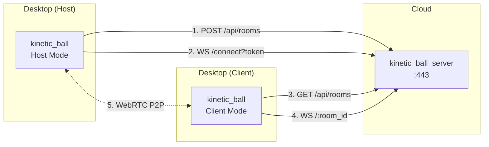

# ADR-001: Reestructuración de Arquitectura Client/Server

**Fecha:** 2026-01-23
**Estado:** Propuesto
**Autores:** Anibal

## Contexto

Actualmente el proyecto tiene la siguiente estructura:

```
kinetic_ball/
├── client/      # App gráfica Bevy (solo cliente)
├── server/      # Servidor de física (solo servidor)
├── proxy/       # Proxy con REST API y WebSocket
├── shared/      # Código compartido
└── maps/
```

**Problemas identificados:**

1. **Experiencia de usuario fragmentada**: Para jugar localmente se necesitan 3 procesos (matchbox, proxy, server) + el cliente
2. **No hay opción de hostear desde el cliente**: El servidor es una app headless separada
3. **Deployment complejo**: Múltiples binarios para deployar en producción
4. **Arquitectura poco convencional**: La mayoría de juegos permiten hostear desde la misma app

## Decisión

Reestructurar el proyecto en dos componentes principales:

### 1. `kinetic_ball` (App de Escritorio)

Aplicación unificada que puede:
- **Unirse a una room** (modo cliente)
- **Crear una room** (modo host = servidor + cliente local)

```
kinetic_ball/
├── src/
│   ├── main.rs
│   ├── app.rs              # Estados de la app (Menu, Lobby, InGame)
│   ├── ui/
│   │   ├── mod.rs
│   │   ├── menu.rs         # Menú principal
│   │   ├── lobby.rs        # Lista de rooms, crear room
│   │   └── settings.rs     # Configuración de teclas
│   ├── game/
│   │   ├── mod.rs
│   │   ├── physics.rs      # Sistemas de física (Rapier2D)
│   │   ├── player.rs       # Componentes de jugador
│   │   ├── ball.rs         # Componentes de pelota
│   │   └── input.rs        # Manejo de input
│   ├── network/
│   │   ├── mod.rs
│   │   ├── protocol.rs     # Mensajes de red
│   │   ├── client.rs       # Lógica de cliente WebRTC
│   │   └── host.rs         # Lógica de host (servidor + cliente)
│   ├── rendering/
│   │   ├── mod.rs
│   │   ├── sprites.rs
│   │   ├── camera.rs
│   │   └── minimap.rs
│   └── map/
│       ├── mod.rs
│       ├── loader.rs
│       └── converter.rs
├── assets/
├── Cargo.toml
└── README.md
```

**Flujo de usuario:**



### 2. `kinetic_ball_server` (Servidor Cloud)

Servidor unificado que incluye:
- Proxy REST API para rooms
- WebSocket proxy
- Matchbox signaling embebido

```
kinetic_ball_server/
├── src/
│   ├── main.rs
│   ├── config.rs           # Configuración CLI/env
│   ├── state.rs            # Estado de rooms
│   ├── api/
│   │   ├── mod.rs
│   │   └── rooms.rs        # REST endpoints
│   ├── ws/
│   │   ├── mod.rs
│   │   ├── proxy.rs        # WebSocket proxy
│   │   └── signaling.rs    # Matchbox embebido
│   └── tls/
│       └── acme.rs         # Auto TLS con Let's Encrypt
├── Dockerfile
├── docker-compose.yml
└── README.md
```

**Arquitectura de red:**



## Plan de Migración

### Fase 1: Preparación

1. [ ] Crear rama `feature/unified-architecture`
2. [ ] Documentar API actual del proxy
3. [ ] Identificar código reutilizable en shared/

### Fase 2: kinetic_ball_server

1. [ ] Renombrar `proxy/` → `kinetic_ball_server/`
2. [ ] Integrar matchbox_server como biblioteca
   ```toml
   [dependencies]
   matchbox_server = "0.13"
   ```
3. [ ] Unificar signaling y proxy en un solo servidor
4. [ ] Crear Dockerfile
5. [ ] Crear docker-compose.yml
6. [ ] Tests de integración

### Fase 3: kinetic_ball (App Unificada)

#### 3.1 Estructura base ya existente
- [x] Crate `kinetic_ball` creado con Cargo.toml unificado
- [x] Código de host migrado en `src/host/`:
  - `host.rs` - Función principal y setup del host
  - `engine.rs` - Sistemas de física y lógica de juego
  - `network.rs` - WebRTC server y comunicación
  - `input/` - GameInputManager y NetworkInputSource
  - `map/` - Loader y converter de mapas

#### 3.2 Migrar código de cliente (rendering)
1. [ ] Copiar `client/src/main.rs` como base para modo cliente
2. [ ] Migrar sistemas de rendering:
   - Sprites (jugadores, pelota, efectos visuales)
   - Cámara y seguimiento
   - Minimap
   - UI in-game (scores, nombres)
3. [ ] Migrar `client/src/keybindings.rs` para input local
4. [ ] Copiar assets: `client/assets/` → `kinetic_ball/assets/`

#### 3.3 Copiar código compartido (shared)
1. [ ] Copiar `shared/src/` → `kinetic_ball/src/shared/`:
   - `protocol.rs` - PlayerInput, GameState, etc.
   - `movements.rs` - PlayerMovement
   - `map.rs` - Estructuras de mapas
   - `lib.rs` - GameConfig y exports

#### 3.4 Implementar modo dual
1. [ ] Crear `src/app.rs` con estados de la app:
   ```rust
   enum AppState {
       Menu,        // Menú principal
       Lobby,       // Ver/crear rooms
       HostMode,    // Ejecuta física + rendering local
       ClientMode,  // Solo rendering, recibe estado
   }
   ```
2. [ ] Crear `src/network/client.rs`:
   - Conectarse a room existente vía WebSocket
   - Recibir GameState y actualizar ECS
   - Enviar PlayerInput local
3. [ ] Adaptar `src/host/host.rs`:
   - Cambiar de función standalone a plugin/sistema de Bevy
   - Integrar con AppState::HostMode
   - Añadir rendering para el host local

#### 3.5 UI de lobby
1. [ ] Crear `src/ui/menu.rs`:
   - Botón "Crear Sala"
   - Botón "Unirse a Sala"
   - Botón "Configuración"
2. [ ] Crear `src/ui/lobby.rs`:
   - Lista de rooms (GET /api/rooms)
   - Crear room: formulario + POST /api/rooms
   - Unirse: seleccionar room + conectar WebSocket
3. [ ] Crear `src/ui/settings.rs`:
   - Configuración de keybindings
   - Configuración de red (proxy URL)

#### 3.6 Integración y tests
1. [ ] Compilar y resolver dependencias
2. [ ] Test: Crear sala desde la app y jugar como host
3. [ ] Test: Unirse a sala desde otra instancia como cliente
4. [ ] Test: Migrar entre estados (Menu → Lobby → Game → Menu)

### Fase 4: Limpieza

1. [ ] Eliminar `client/` y `server/` antiguos
2. [ ] Actualizar `shared/` o moverlo a `kinetic_ball/src/`
3. [ ] Actualizar README.md
4. [ ] Actualizar CI/CD

### Fase 5: Release

1. [ ] Tag v0.2.0
2. [ ] Build binarios para Windows/Linux/macOS
3. [ ] Publicar imagen Docker de kinetic_ball_server

## Consecuencias

### Positivas

- **UX simplificada**: Una sola app para jugar, hostear o unirse
- **Deployment simple**: Un solo container en el servidor
- **Menos código duplicado**: Física y rendering en un solo lugar
- **Más fácil de distribuir**: Un binario para usuarios finales

### Negativas

- **Binario más grande**: Cliente incluye código de servidor
- **Migración compleja**: Refactor significativo
- **Host tiene más carga**: Ejecuta física + rendering

### Riesgos

| Riesgo | Mitigación |
|--------|------------|
| Regresiones en física | Tests de integración antes de migrar |
| Problemas de red | Mantener protocolo actual, solo refactorizar estructura |
| Performance en host | Perfilar, optimizar si es necesario |

## Alternativas Consideradas

### A) Mantener estructura actual
- **Pro**: No requiere trabajo
- **Contra**: UX fragmentada persiste

### B) Embeber servidor en cliente como feature flag
- **Pro**: Menos cambios
- **Contra**: Compilación condicional compleja, difícil de mantener

### C) Electron/Tauri wrapper
- **Pro**: UI web más flexible
- **Contra**: Overhead, complejidad, ya tenemos Bevy funcionando

## Referencias

- [matchbox_server como biblioteca](https://docs.rs/matchbox_server)
- [Bevy game states](https://bevy-cheatbook.github.io/programming/states.html)
- [Docker multi-stage builds](https://docs.docker.com/build/building/multi-stage/)
